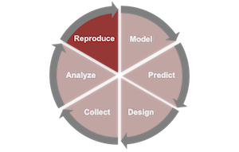
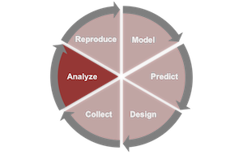
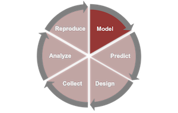
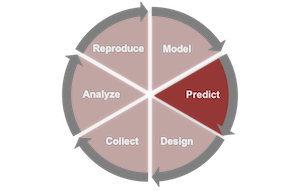

```{r setup, include=FALSE}
knitr::opts_chunk$set(echo = FALSE, warning = FALSE, strip.white=TRUE, tidy=TRUE)
start.time=Sys.time()
```

[Note] This is a *R/Stan notebook* for exploratory data analysis and fitting a logistic regression model on recorded decisions (cooperation or defection) by indivisuals during a series of networked and incentivized economic game experiment. 



This is a reproduced and extended analysis from @Rand29112011.

+ Each player resides on a nonweighted network, with 20% possible links formed at *random*.
+ His/her *neighbors* are players connected to him/her on this network.
+ Each player exercises one of the following two actions during each round of the game.
    - Cooperation: paying 50 units for each neighbor and results in 100 units gain for each neighbor. 
    - Defection: paying nothing and generating no benefits.
+ Before each round, players are reminded of their number of neighbors and these neighbors' prior decisions. 
+ After each round, players learn about the decisions of their neighbors and their own payoff.
+ The probability for each subsequent round is 0.8, which was communicated to players. 

Experimental conditions:

+ **Fixed** links 
+ **Random** link updating (whole network regenerated at each round)
+ Strategic link updating: a rewiring step following each round. Subject pairs are randomly selected and one randomly selected actor of the selected pair will be given the option to change the status between the pair (connected to disconnected, or disconnected to connected.) The deciding actor will be provided with behavior of the alter's during the previous round. At the end of the rewiring step, each player will receive summaries about updates involved him/her. 
    - **Viscous**: 10% randomly picked subject pairs selected to have an option of change.
    - **Fluid**: 30% randomly picked subject pairs selected to have an option of change.


```{r load_libs, message=F, include=FALSE}
if (!require("dplyr")) install.packages('dplyr')
if (!require("multiwayvcov")) install.packages('multiwayvcov')
if (!require("lmtest")) install.packages('lmtest')
if (!require("rstan")) install.packages('rstan')
if (!require("DT")) install.packages('DT')
if (!require("ggplot2")) install.packages('ggplot2')
if (!require("rstanarm")) install.packages('rstanarm')
if (!require("data.table")) install.packages('data.table')
if (!require("boot")) install.packages('boot')

library("dplyr")
library ("multiwayvcov")
library ("lmtest")
library("rstan")
library("DT")
library("ggplot2")
library('rstanarm')
library('data.table')
library('boot')
```

### Download the data and import the data into `R`.

In the *notebook* mode, we are able to process data from a URL link. This greatly improves reproducibility. 

```{r load-data}
#temp <- tempfile()
#download.file("http://davidrand-cooperation.com/s/Rand2011PNAS_data_and_code-pi6b.zip",
#              "data/Rand2011PNAS_data_and_code-pi6b.zip", 
#              mode="wb")
#unzip("Rand2011PNAS_data_and_code-pi6b.zip")
cooperation <- read.table("data/Rand2011PNAS_cooperation_data.txt", sep="\t",skip=0, header=T)
names(cooperation)
datatable(sample_n(cooperation, 50), 
          caption = "Randomly selected rows of data.",
          options = list(
              scrollX = TRUE,
              scrollCollapse = TRUE))
```

#### Basic information about the data set.

```{r relevel_condition}
levels(cooperation$condition)=list(Fixed="Static",
                                   Random="Random",
                                   Viscous="Viscous",
                                   Fluid="Fluid")
```

Here are some of the statistics for this data (generated in-line): 

+ There are `r length(unique(cooperation$playerid))/10` unique players
+ In `r length(unique(cooperation$sessionnum))` sessions. 
+ Each session has one of the `r length(unique(cooperation$condition))` conditions: `r unique(cooperation$condition)`.

### Explore overall patterns of experimental sessions



```{r session_summary}

session_info=cooperation%>%
  filter(round_num==1)%>%
  group_by(sessionnum)%>%
  summarise(
    num_player=n(),
    condition=unique(condition)[1]
  )%>%
  arrange(condition)
```

#### Here is the summarized session information. 

```{r display_DT, warning=FALSE}
## Display session_info
datatable(session_info, 
          caption = "Sessions: number of players and game conditions",
          options = list(
              scrollX = TRUE,
              scrollCollapse = TRUE))
```

#### The number of players vary within and between experimental conditions. 

```{r display_numplayers}
ggplot(data = session_info, aes(x=num_player))+
  geom_histogram(aes(weights=..count.., 
                     fill=condition))+
  scale_fill_brewer(palette="Set3")+
  facet_wrap(~condition, ncol=1)
```

#### Cooperation rate over the course of a game.

+ The rate of cooperation exhibits decline as the game proceeds
+ The declining patterns are different between experimental conditions. 

```{r session_plot}
session_round_rate=cooperation%>%
                      group_by(sessionnum, 
                               round_num)%>%
                      summarise(
                        rate_contr=mean(decision..0.D.1.C.)
                      )
session_round_rate=left_join(session_round_rate, 
                             session_info,
                             by="sessionnum")

ggplot(session_round_rate, 
       aes(x=factor(round_num), 
           y=rate_contr,
           fill=condition))+
    geom_boxplot()+
    facet_grid(.~condition)+
    labs(x="round")+
    theme(axis.text.x=element_text(angle=0, 
                                   vjust=0.4,
                                   hjust=1))
```

#### Behavior transition during the course of a game. 

+ Players most likely stay in one mode;
+ And more likely to shift from cooperation to defection than vice versa.

```{r display_transtion, fig.width=3, fig.height=4}

action.info=
  cooperation%>%
  group_by(previous_decision, 
           decision..0.D.1.C.)%>%
  summarise(
    count=n()
  )

# reorder the rows

action.info=action.info[c(4,1,3,2), ]

barplot(t(action.info[,3]),
        ylab="num of instances",
        names.arg = c("C -> C","D -> D",
                      "C -> D", "D -> C"),
        main = "plot to show change in decision in two consecutive round",
        col=c("lightgray"))

```

#### Association between behavior and social connections.

+ Players' tendence to contribute depends on their number of neighbors and whether they can choose their neighbors. 

```{r display_coop_neigh}
coop_neighbor=
  cooperation%>%
  group_by(condition, 
           num_neighbors, 
           sessionnum)%>%
  summarise(
    rate_contr=mean(decision..0.D.1.C.)
  )

ggplot(coop_neighbor, 
       aes(x=factor(num_neighbors), 
           y=rate_contr,
           fill=condition))+
    geom_boxplot()+
    facet_grid(.~condition)+
    labs(x="number of neighbors")+
    theme(axis.text.x=element_text(angle=0, 
                                   vjust=0.4,
                                   hjust=1))
```
```{r display_coop_round}
ggplot(cooperation, 
       aes(x=factor(round_num), 
           y=num_neighbors,
           fill=condition))+
    geom_boxplot()+
    facet_grid(.~condition)+
    labs(x="round")+
    theme(axis.text.x=element_text(angle=0, 
                                   vjust=0.4,
                                   hjust=1))
```

### Fitting logistic regression models. 


For the main model in @Rand29112011, the factors of interest are *round number* and *fluid condition*. 

Main conclusion from @Rand29112011 states that *rapidly updating networks promote cooperation relative to other conditions* (coeff = 0.135, p = .006).

```{r}
logit <- glm(decision..0.D.1.C.~ fluid_dummy*round_num, 
             data = cooperation, 
             family = "binomial")
logit.multiwayvcov <- cluster.vcov(logit, 
                                   cbind(cooperation$sessionnum, 
                                         cooperation$playerid))
coeftest(logit, logit.multiwayvcov)
```

#### Logistic regression model under a Bayesian framework and carry out the modeling using Stan

##### Option 1, we can specify a full Bayesian logistic regression model from scratch. 

```{r}
dat <- list(N        = nrow(cooperation),
            p        = 4,
            decision    = cooperation$decision..0.D.1.C.,
            fluid_dummy = cooperation$fluid_dummy,
            round_num      = cooperation$round_num)
fileName <- "./lib/logit.stan"
stan_code <- readChar(fileName, 
                      file.info(fileName)$size)
cat(stan_code)
```


<!-- ```{stan output.var=} -->
<!-- data { -->

<!--    int<lower=0> N; // Number of observations (an integer) -->
<!--    int<lower=0> p; // Number of parameters -->
<!--    // Variables -->
<!--    int decision[N]; -->
<!--    int<lower=0>  round_num[N]; -->
<!--    int<lower=0>  fluid_dummy[N]; -->
<!--  } -->

<!--  parameters { -->
<!--    // Define parameters to estimate -->
<!--    real beta[p]; -->
<!--  } -->

<!--  transformed parameters  { -->
<!--    // Probability trasformation from linear predictor -->
<!--    real<lower=0> odds[N]; -->
<!--    real<lower=0, upper=1> prob[N]; -->

<!--    for (i in 1:N) { -->
<!--      odds[i] <- exp(beta[1] + beta[2]*fluid_dummy[i] + beta[3]*round_num[i] +   beta[4]*round_num[i]*fluid_dummy[i]); -->
<!--      prob[i] <- odds[i] / (odds[i] + 1); -->
<!--    } -->
<!--  } -->

<!--  model { -->
<!--   // Prior part of Bayesian inference (flat if unspecified) -->

<!--     decision ~ bernoulli(prob); // Likelihood part of Bayesian inference -->
<!--  } -->
<!-- ``` -->


```{r, message=F, echo=T, include=F}
resStan <- stan(model_code = stan_code, data = dat,
                chains = 3, iter = 3000, warmup = 500, thin = 10)
```

Convergence of the MCMC algorithm can be monitored and inspected. 

```{r}
## Show traceplot
traceplot(resStan, pars = c("beta"), inc_warmup = TRUE)
```

These are the coefficient in generalized linear model without stan:

```{r}
logit$coefficients
```

These are the coefficients in generalized linear model when using Stan and our implementation of the model:
```{r}
list_of_draws <- extract(resStan)
list_of_draws$beta[dim(list_of_draws$beta)[2],]
```

However, the mean of draws are:
```{r}
c(mean(list_of_draws$beta[,1]),
  mean(list_of_draws$beta[,2]),
  mean(list_of_draws$beta[,3]),
  mean(list_of_draws$beta[,4]))
```

##### Option 2, we can use wrapper functions provided in the `rstanarm` package. 

```{r, eval=F}
cooperation$decision=cooperation$decision..0.D.1.C.
glm.out=stan_glm(decision~fluid_dummy+round_num+fluid_dummy*round_num, 
                data=cooperation,
                family = binomial(link = "logit"), 
                prior = student_t(df = 7), 
                prior_intercept = student_t(df = 7),
                chains = 3, iter = 3000)

cbind(Median = coef(glm.out), 
      MAD_SD = se(glm.out))
```

```{r, message=F, echo=T, include=F}
cooperation$decision=cooperation$decision..0.D.1.C.
glm.out=stan_glm(decision~fluid_dummy+round_num+fluid_dummy*round_num, 
                data=cooperation,
                family = binomial(link = "logit"), 
                prior = student_t(df = 7), 
                prior_intercept = student_t(df = 7),
                chains = 3, iter = 3000)
```

```{r}
cbind(Median = coef(glm.out), MAD_SD = se(glm.out))
```

Posterior draws are:
```{r}
par(mfrow=c(1,4))
hist(list_of_draws$beta[,1],main="beta[1]", xlab = " ")
hist(list_of_draws$beta[,2],main="beta[2]", xlab = " ", ylab=" ")
hist(list_of_draws$beta[,3],main="beta[3]", xlab = " ", ylab=" ")
hist(list_of_draws$beta[,4],main="beta[4]", xlab = " ", ylab=" ")
```

#### Predictive model checking



```{r}
y_rep <- posterior_predict(glm.out)
dim(y_rep)
```

```{r}
data.mean=
  cooperation%>%
  group_by(fluid_dummy, 
           round_num)%>%
  summarise(
    mean_decision=mean(decision)
  )

predicted.mean=NULL
for(i in 1:nrow(y_rep)){
  tmp=cooperation
  tmp$predicted=y_rep[i,]
  tmp.mean=
    tmp%>%
    group_by(fluid_dummy, round_num)%>%
    summarise(
      mean_decision=mean(predicted)
    )
  tmp.mean$rep=rep(i, nrow(tmp.mean))
  predicted.mean=rbind(predicted.mean, tmp.mean)
}
```

```{r}
ggplot(predicted.mean, aes(x=factor(round_num), 
                           y=mean_decision,
                           fill=fluid_dummy))+
        geom_boxplot()+
        facet_grid(.~factor(fluid_dummy))+
        labs(x="round")+
        theme(axis.text.x=element_text(angle=0, vjust=0.4,hjust=1))

par(mfrow=c(1,2))
boxplot(mean_decision~round_num,
        data=predicted.mean[predicted.mean$fluid_dummy == 1, ], 
        main = "Fluid = 1", pch = NA,
        xlab = "round", 
        ylab = "Proportion of cooperation")
with(data.mean[data.mean$fluid_dummy==1, ],
     points(round_num, mean_decision,
            pch = 16, col = "red"))

boxplot(mean_decision~round_num,
        data=predicted.mean[predicted.mean$fluid_dummy == 0, ], 
        main = "Fluid = 0", pch = NA,
        xlab = "round", 
        ylab = "Proportion of cooperation")
with(data.mean[data.mean$fluid_dummy==0, ],
     points(round_num, mean_decision,
            pch = 16, col = "red"))

```

##### More detailed inspection of model fit for individual game sessions. 

```{r}
data.mean=
  cooperation%>%
  filter(fluid_dummy==1)%>%
  group_by(sessionnum, round_num)%>%
  summarise(
    mean_decision=mean(decision)
  )

predicted.mean=NULL
for(i in 1:nrow(y_rep)){
  tmp=cooperation
  tmp$predicted=y_rep[i,]
  tmp.mean=
    tmp%>%
    filter(fluid_dummy==1)%>%
    group_by(sessionnum, round_num)%>%
    summarise(
      mean_decision=mean(predicted)
    )
  tmp.mean$rep=rep(i, nrow(tmp.mean))
  predicted.mean=rbind(predicted.mean, tmp.mean)
}
```

```{r, fig.height=8}
ggplot(predicted.mean, aes(x=factor(round_num), 
                           y=mean_decision,
                           fill=sessionnum))+
        geom_boxplot()+
        facet_wrap(~sessionnum, ncol=4)
        labs(x="round")+
        theme(axis.text.x=element_text(angle=0, vjust=0.5,hjust=1))

par(mfrow=c(3,4))
for(i in unique(predicted.mean$sessionnum)){
  boxplot(mean_decision~round_num,
          data=predicted.mean[predicted.mean$sessionnum == i, ], 
          main = paste("session", i), pch = NA,
          xlab = "round", 
          ylab = "Proportion of cooperation")
  with(data.mean[data.mean$sessionnum == i, ],
       points(round_num, mean_decision,
              pch = 16, col = "red"))
}

```


#### Extended logistic regression with random session effects. 

```{r, eval=F}
cooperation$decision=cooperation$decision..0.D.1.C.
glm.out2=stan_glmer(decision~fluid_dummy+round_num+
                     fluid_dummy*round_num+(1 | sessionnum),
                data=cooperation,
                family = binomial(link = "logit"), 
                prior = student_t(df = 7), 
                prior_intercept = student_t(df = 7),
                chains = 3, iter = 3000)
```

```{r, message=F, echo=T, include=F}
cooperation$decision=cooperation$decision..0.D.1.C.
glm.out2=stan_glmer(decision~fluid_dummy+round_num+
                     fluid_dummy*round_num+(1 | sessionnum),
                data=cooperation,
                family = binomial(link = "logit"), 
                prior = student_t(df = 7), 
                prior_intercept = student_t(df = 7),
                chains = 3, iter = 3000)
```

```{r}
y_rep <- posterior_predict(glm.out2)
dim(y_rep)
```

```{r}
data.mean=
  cooperation%>%
  filter(fluid_dummy==1)%>%
  group_by(sessionnum, round_num)%>%
  summarise(
    mean_decision=mean(decision)
  )

predicted.mean=NULL
for(i in 1:nrow(y_rep)){
  tmp=cooperation
  tmp$predicted=y_rep[i,]
  tmp.mean=
    tmp%>%
    filter(fluid_dummy==1)%>%
    group_by(sessionnum, round_num)%>%
    summarise(
      mean_decision=mean(predicted)
    )
  tmp.mean$rep=rep(i, nrow(tmp.mean))
  predicted.mean=rbind(predicted.mean, tmp.mean)
}
```

##### Added session-level random effects lead to better fit. 

```{r, fig.height=8}
ggplot(predicted.mean, aes(x=factor(round_num), 
                           y=mean_decision,
                           fill=sessionnum))+
        geom_boxplot()+
        facet_wrap(~sessionnum, ncol=4)
        labs(x="round")+
        theme(axis.text.x=element_text(angle=0, vjust=0.5,hjust=1))

par(mfrow=c(3,4))
for(i in unique(predicted.mean$sessionnum)){
  boxplot(mean_decision~round_num,
          data=predicted.mean[predicted.mean$sessionnum == i, ], 
          main = paste("session", i), pch = NA,
          xlab = "round", 
          ylab = "Proportion of cooperation")
  with(data.mean[data.mean$sessionnum == i, ],
       points(round_num, mean_decision,
              pch = 16, col = "red"))
}

```

```{r, include=F}
end.time=Sys.time()
run.time=difftime(end.time, start.time, "secs")
```

This report was produced in `r format(run.time)`.

More examples of `rstanarm` can be found at <https://cran.r-project.org/web/packages/rstanarm/>.


#### Analysis with Bootstrapping
In this section, we use bootstrapped data set (resampled data sets from original set).
#### sampling from rows
This part consider each row as a data point
```{r}
logit.bootstrap <- function(data, indices) {
    d <- data[indices, ]
  fit.glm <- glm(decision..0.D.1.C.~ fluid_dummy*round_num, data = d, family = "binomial")
  return(coef(fit.glm))
}

logit.boot <- boot(data=cooperation, statistic=logit.bootstrap, R=30) # R: number of samples


fileName <- "./lib/logit.stan"
stan_code <- readChar(fileName, 
                      file.info(fileName)$size)
cat(stan_code)

logit.stan.bootstrap <- function(data , indices){
  d <- data[indices,]
  dat <- list(N        = nrow(d),
            p        = 4,
            decision    = d$decision..0.D.1.C.,
            fluid_dummy = d$fluid_dummy,
            round_num      = d$round_num)
  fit.stan.logit <- stan(model_code = stan_code, data = dat,
                chains = 3, iter = 3000, warmup = 500, thin = 10)
  list_of_draws.bootstrap <- extract(fit.stan.logit)
  return(list_of_draws.bootstrap$beta[dim(list_of_draws.bootstrap$beta)[2],])
}

logit.stan.boot <- boot(data=cooperation, statistic=logit.stan.bootstrap, R=3) # R: number of samples


```

#### Bootstrapping with respect to session number
This part performs bootstrapping when resampling from sessions.
First, specify the number of bootstrapped sets:
```{r}
num.boot.sets = 2
```

Bootstrapped data set:
```{r}
samp = matrix(nrow=num.boot.sets,ncol=length(unique(cooperation$sessionnum)))
logit.bootstrap.session = matrix(nrow=num.boot.sets,ncol=4)
bootstrap.session.beta = array(rep(0,num.boot.sets*4*750),c(750,4,num.boot.sets))
y_rep = array(rep(0,4500*3876*num.boot.sets),c(4500,3876,num.boot.sets))

for (i in 1:num.boot.sets){
  samp[i,] <- sample(unique(cooperation$sessionnum),40, replace=TRUE)
  tmp.assign <- do.call(rbind, lapply(samp[i,], function(x) cooperation[cooperation$sessionnum == x,]))
  logit.bootstrap.session.tmp <- glm(decision..0.D.1.C.~ fluid_dummy*round_num, data = tmp.assign,family = "binomial")
  logit.bootstrap.session[i,] = logit.bootstrap.session.tmp$coefficients
 
  dat.bootstrap.session.tmp <- list(N        = nrow(tmp.assign),
                                  p        = 4,
                                  decision    = tmp.assign$decision..0.D.1.C.,
                                  fluid_dummy = tmp.assign$fluid_dummy,
                                  round_num      = tmp.assign$round_num)
 fileName <- "./lib/logit.stan"
 stan_code <- readChar(fileName, 
                      file.info(fileName)$size)
 cat(stan_code)
 resStan.bootstrap.session.tmp <- stan(model_code = stan_code, data = dat.bootstrap.session.tmp,
                chains = 3, iter = 3000, warmup = 500, thin = 10)

 list_of_draws.bootstrap.session.tmp <- extract(resStan.bootstrap.session.tmp)
 bootstrap.session.beta[,,i] <- list_of_draws.bootstrap.session.tmp$beta
 y_rep[,,i] <- posterior_predict(glm.out)
 
}


```

#### Summary for Bootstrapping
This table shows the summary of results for bootstrapping.
```{r}
mytable <- rbind(logit$coefficients,
                 logit.bootstrap.session,
                 list_of_draws$beta[dim(list_of_draws$beta)[2],],
                 t(bootstrap.session.beta[dim(bootstrap.session.beta)[1],,]))
rownames(mytable) <- c("logit","logit_boot_1","logit_boot_2","Bayes_logit","Bayes_logit_boot_1","Bayes_logit_boot_2") # for 2bootstraps
datatable(mytable, 
          caption = "coefficients for linear regression usign different methods and bootstrapping",
          options = list(
              scrollX = TRUE,
              scrollCollapse = TRUE))
```


Posterior distribution draws are as follow:

```{r}
for (j in 1:4){
  par(mfrow=c(1,3))
  plot(density(list_of_draws$beta[,j]),xlab = " ", ylab=" ",main="orig_bayes")
  for (i in 1:num.boot.sets){
  plot(density(bootstrap.session.beta[,j,i]),xlab = " ", ylab=" ",main=paste0("boot",i))
  }
}
```


#### Comparing KL-divergence
```{r}
KL.divergence <- array(rep(0,(1+num.boot.sets)*(1+num.boot.sets)*4),c((1+num.boot.sets),(1+num.boot.sets),4))
for (j in 1:4){
  for (i in 1:(1+num.boot.sets)){
    for (q in 1:(1+num.boot.sets)){
      if (i==1){
        if(q==1)
          KL.divergence[i,q,j] <- KLD(list_of_draws$beta[,j],list_of_draws$beta[,j])$sum.KLD.px.py
      
        else{
          KL.divergence[i,q,j] <- KLD(list_of_draws$beta[,j],bootstrap.session.beta[,j,(q-1)])$sum.KLD.px.py
        }
      }
      else{
        if(q==1){
          KL.divergence[i,q,j] <- KLD(bootstrap.session.beta[,j,(i-1)],list_of_draws$beta[,j])$sum.KLD.px.py
        }
        else{
          KL.divergence[i,q,j] <- KLD(bootstrap.session.beta[,j,(i-1)],bootstrap.session.beta[,j,(q-1)])$sum.KLD.px.py
        }
      }
    }
  }
}

row.names(KL.divergence) <- c("orig_bayes","boot1","boot2")
colnames(KL.divergence) <- c("orig_bayes","boot1","boot2")
KL.divergence

```

#### Predicted mean
choose index of bootstrap sample:
```{r}
boot.ind = 1
```


```{r}

data.mean=
  cooperation%>%
  group_by(fluid_dummy, 
           round_num)%>%
  summarise(
    mean_decision=mean(decision)
  )

predicted.mean=NULL
for(i in 1:nrow(y_rep)){
  tmp=cooperation
  tmp$predicted=y_rep[i,,boot.ind]
  tmp.mean=
    tmp%>%
    group_by(fluid_dummy, round_num)%>%
    summarise(
      mean_decision=mean(predicted)
    )
  tmp.mean$rep=rep(i, nrow(tmp.mean))
  predicted.mean=rbind(predicted.mean, tmp.mean)
}
```

```{r}
ggplot(predicted.mean, aes(x=factor(round_num), 
                           y=mean_decision,
                           fill=fluid_dummy))+
        geom_boxplot()+
        facet_grid(.~factor(fluid_dummy))+
        labs(x="round")+
        theme(axis.text.x=element_text(angle=0, vjust=0.4,hjust=1))

par(mfrow=c(1,2))
boxplot(mean_decision~round_num,
        data=predicted.mean[predicted.mean$fluid_dummy == 1, ], 
        main = "Fluid = 1", pch = NA,
        xlab = "round", 
        ylab = "Proportion of cooperation")
with(data.mean[data.mean$fluid_dummy==1, ],
     points(round_num, mean_decision,
            pch = 16, col = "red"))

boxplot(mean_decision~round_num,
        data=predicted.mean[predicted.mean$fluid_dummy == 0, ], 
        main = "Fluid = 0", pch = NA,
        xlab = "round", 
        ylab = "Proportion of cooperation")
with(data.mean[data.mean$fluid_dummy==0, ],
     points(round_num, mean_decision,
            pch = 16, col = "red"))

```

